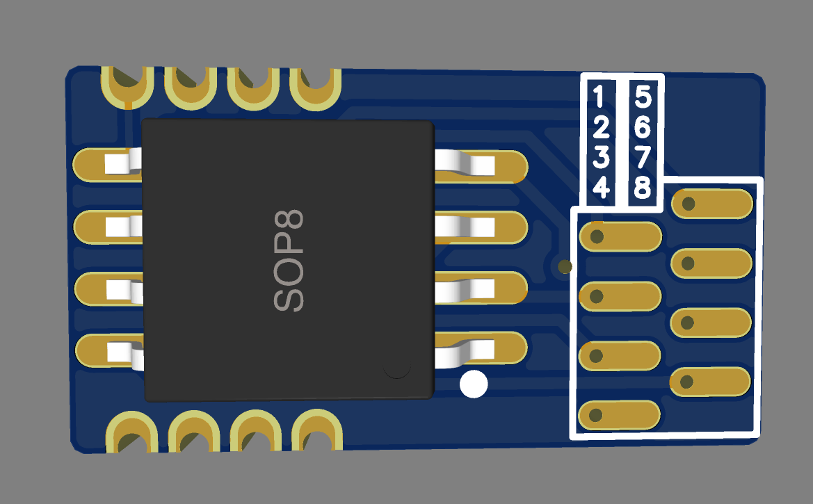
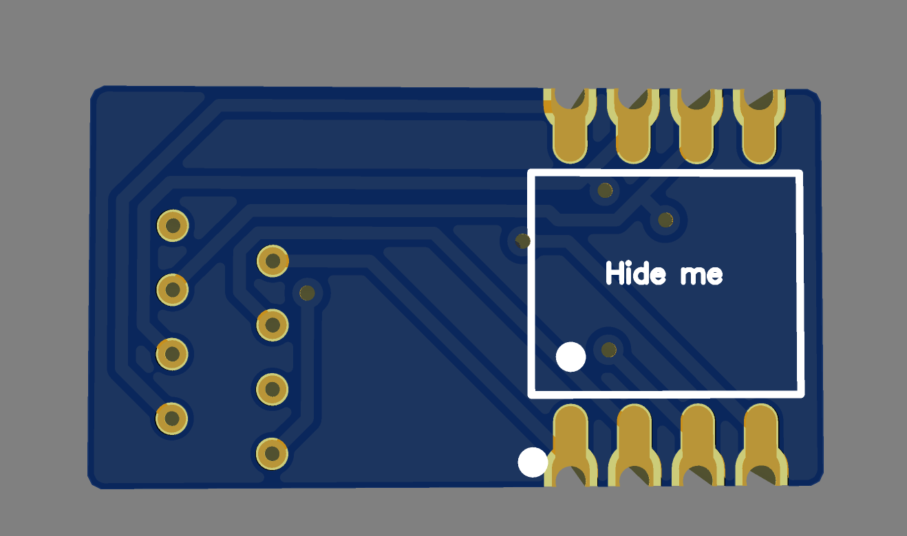

<!DOCTYPE html>
<html lang="en">
<head>
  <meta charset="UTF-8">
  <title>Bios Programmer PCB</title>
  
</head>
<body>
  <header>
    <h1>Bios Programmer PCB</h1>
  </header>
  
  

    <section>
      <h2>Overview</h2>
      
This repository contains the design files for the BIOS Programming PCB. The project aims to simplify the process of programming BIOS chips with a reliable and efficient design.

    </section>
    
    <section>
      <h2>Repository Structure</h2>
      <ul>
        <li><strong>Images</strong>: Contains images of the PCB (front and back views).</li>
        <li><strong>PCB</strong>: Contains the PCB design files.</li>
        <li><strong>README.html</strong>: This documentation file in HTML format.</li>
      </ul>
    </section>
    
    <section>
      <h2>Images</h2>
      

        

          <h3>Front View</h3>
          
        

        

          <h3>Back View</h3>
          
        

      

    </section>
      
    <section>
      <h2>Clone the Repository</h2>
      <ol>
        <li>
          <pre>git clone https://github.com/O-o-o-p-s/Bios-Programmer-PCB.git</pre>
        </li>
      </ol>
    </section>
    
    <section>
      <h2>Contributing</h2>
      
Contributions are welcome! If you have suggestions or improvements, please open an issue or submit a pull request.

    </section>
    
    <section>
      <h2>License</h2>
      
This project is licensed under the <a href="LICENSE">MIT License</a>.

    </section>
    
    <section>
      <h2>Contact</h2>
      
For any questions or feedback, please open an issue in this repository.

    </section>
  

  
  <footer>
    
Bios Programmer PCB &mdash; Simplifying BIOS programming for your projects.

  </footer>
</body>
</html>
